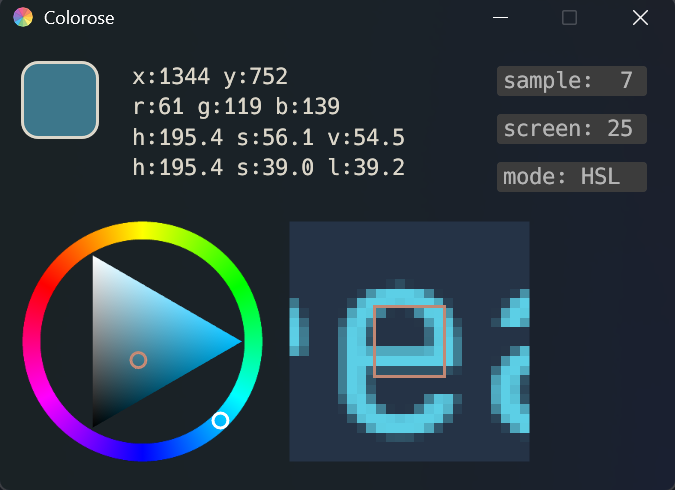

# Colorose

用纯`rust`加`egui`框架完成的一款小程序，用来显示鼠标处的颜色，目前支持显示 rgb，hsv，
色轮，和鼠标附近像素。

## screenshot

点击 sample 按钮可以修改采样的范围，左键右键分别是减少和增加。

点击 screen 按钮可以修改显示鼠标附近像素的范围，左键右键分别是减少和增加。

点击 mode 按钮可以修改色轮的显示模式，分别是HSL和HSV。

## TODO

- [x] 支持范围取色（范围取平均）
- [x] 显示 hsl
- [x] 增加颜色显示
- [x] 支持色轮在 hsv 和 hsl 切换
- [x] 可调节显示的附近像素范围
- [ ] 复制颜色数据按钮
- [x] 亚克力模糊背景(不重要)
- [ ] 范围取色支持圆形
