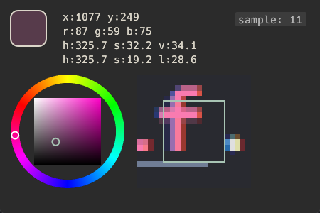

# Colorose

用纯`rust`加`egui`框架完成的一款小程序，用来显示鼠标处的颜色，目前支持显示rgb，hsv，
色轮，和鼠标附近像素。

## screenshot

点击sample按钮可以修改采样的范围，左键右键分别是增加和减少。

## TODO

- [x] 支持范围取色（范围取平均）
- [x] 显示hsl
- [x] 增加颜色显示 
- [ ] 支持色轮在hsv和hsl切换
- [ ] 可调节显示的附近像素范围
- [ ] 复制颜色数据按钮
- [ ] 透明模糊背景(不重要)
- [ ] 范围取色支持圆形 